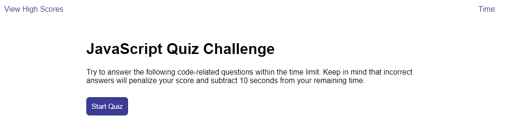
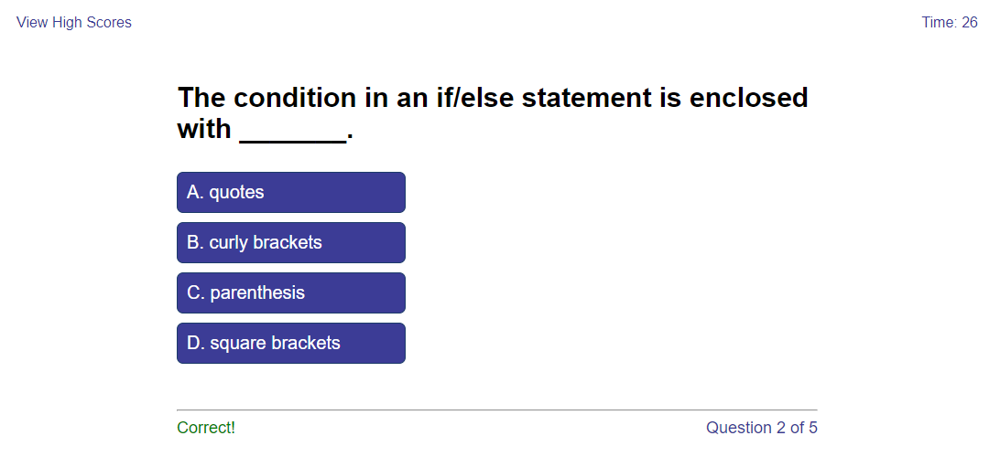
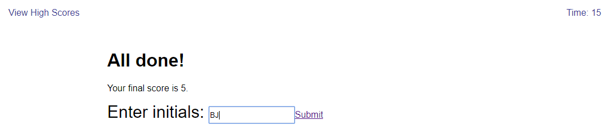
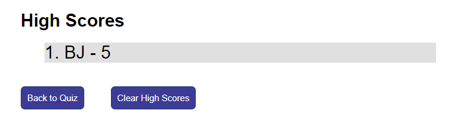

# JavaScript Quiz Challenge

## Purpose
An app that allows a user to take a short timed quiz to try and beat the high score.

## Website
https://brandonljackson23.github.io/js-quiz/index.html

## Overview
The user is presented with a landing page with quiz instructions.  Once the user clicks to begin they timer will begin and the user will be presented with a series of multiple choice questions displayed one at a time.  The user will be notified whether they answered the question correctly and will be given final results once the quiz is complete.  The user will also be presented with thier progress on each question so they know how close they are to completing the quiz.

Once the quiz is complete the user will presented their final results and given the chance to enter their intials to post their score on the high scores board.  Upon submitting thier intials the user will be redirected to the high scores board.

## Workflow
Below is a depiction using screenshots of the workflow of the application:

First, the user is presented with landing page that includes quiz instructions and a button to start the quiz.

Upon clicking the Start Quiz button the user is presented with the first of multiple questions. The questions are in a multiple-choice format and center around basic JavaScript knowledge. In the lower right corner, the user may see their progress towards the end to the quiz.  In the upper right corner, the user may see the amount of time remaining to complete the quiz.  In the upper left corner, the user may click to view the high scores, which will cause them to exit the quiz.

Once the user clicks on thier answer choice the application will advance to the next question in the series and the user will be notified in the bottom left corner of whether they answered the previous question correctly or not.  If the user runs out of time, they will be immediately redirected to the results page.

Once the user completes the quiz, either by completing each question or by running out of time, they will be presented with thier final score and will be given an opportunity to enter their initials to post their score to the high score board.  The initials input field is limited to a maximum of two characters. If the user chooses to enter thier intitials and submit thier results, their score will be saved to the browser's local storage and they will be redirected to the high scores board.

One the High Scores page, the user will be presented with a list of high scores pulled from the browser's local storage.  They will also be given the opportunity to return to the quiz home page or clear the high scores, which is acheived by clearing the browser's local storage.

